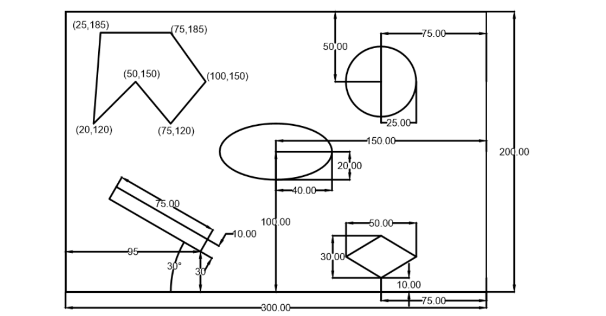
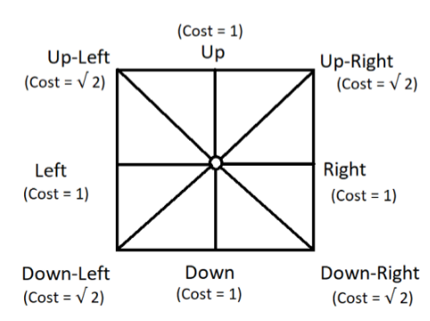
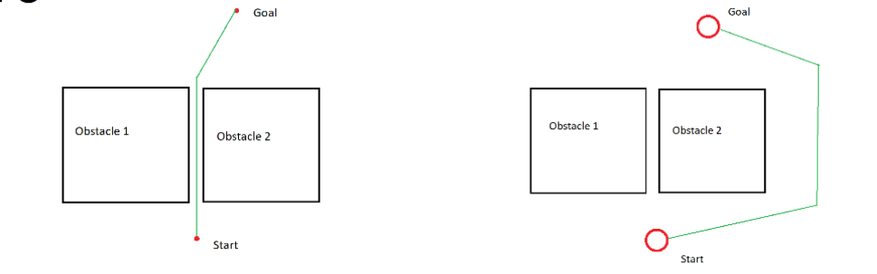
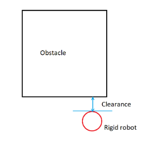

# Dijkstra Point And Rigid Robot

### Description
The aim of this project is to allow a point or rigid robot to move in an 
environment from some specified start location to a goal location through some optimal 
path accounted for by the use of Dijstra algorithm. A brief diagram of depicting the problem is shown below.



### Cost Map
The Map of the workspace is discretized to some number of rows and columns and the cost from moving one location to another is illustrated by the diagram below.



### Point Vs Rigid Robot
A point robot is a theoretical construct and has no dimensions. To somewhat account for this, we create a 2D rigid robot which  depicts  a circle with some given radius. To make the robot safe whilst navigating, we specify a parameter(clearance) which indicates 
a safety distance, a measure of how far a robot can be close to an obstacle without compromising its safety.




### Run the code
Enter the following to run the code.

```
python3 main.py
```
Follow the instructions after running main.py to get the desired output. NB. Enter 1 for point robot and 2 for rigid robot

